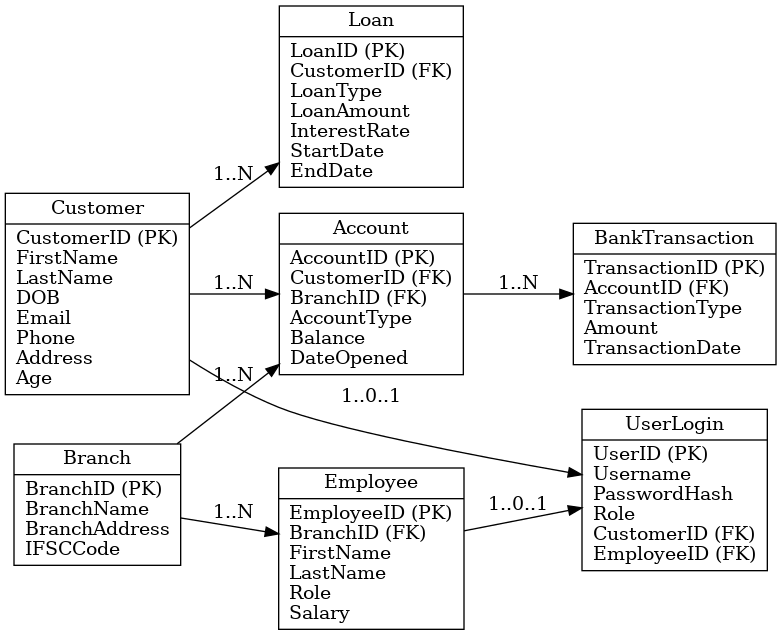

# BankManagement_System
A secure and efficient SQL-based Bank Management System to manage customers, accounts, transactions, loans, branches, and employees. Features normalization, indexing, stored procedures, triggers, ACID transactions, role-based access, and automated alerts for large transactions.
# Bank Management System (SQL) 🏦

The **Bank Management System** is a secure, normalized, and efficient SQL-based database project designed to manage core banking operations. It focuses on **data integrity, automation, and performance optimization**, making it a practical example of applying advanced SQL concepts in a real-world scenario.

---

## 📌 Overview
This project handles essential banking functionalities, including **customers, accounts, transactions, loans, branches, employees, and user authentication**. The database follows **normalization principles** to eliminate redundancy, enforces **constraints** for accuracy, and uses **indexing** for performance enhancement.

---

## 🎯 Features
- **Customer & Account Management** – Create and manage customer profiles, open accounts, and track balances.
- **Transactions** – Deposit, withdraw, and transfer funds using ACID-compliant transactions.
- **Loan Management** – Manage loan details, interest rates, and repayments.
- **Branch & Employee Management** – Organize branches and assign employees to roles.
- **User Authentication** – Role-based access control for security.
- **Automation** – Stored procedures and triggers for operations and validations.
- **Alerts & Statements** – Simulated SMS/email alerts for large transactions and monthly statements.

---

## 🗂 Database Design
- **Entities:** Customer, Account, Transaction, Loan, Branch, Employee, UserLogin
- **Constraints:** PRIMARY KEY, FOREIGN KEY, NOT NULL, UNIQUE, CHECK
- **Performance:** Indexed columns for faster queries
- **ER Diagram:**  
  

---

## ⚙️ Tech Stack
- **Database:** MySQL
- **Concepts Used:** Stored Procedures, Triggers, Transactions, Indexing, Normalization
- **Tools:** MySQL Workbench / phpMyAdmin

---

## 📄 Files Included
- `Bank Management system.sql` – Database creation & data insertion
- `Transactions.sql` – Procedures for transaction operations
- `Otp Generation And Verification.sql` – OTP generation & verification
- `bank_management_er.png` – ER Diagram
- `Approach Documentation.docx` – Project summary

---

## 🚀 How to Run
1. Clone this repository.
2. Import SQL scripts into MySQL.
3. Run stored procedures and test sample transactions.
4. Explore data with provided queries.

---

💡 **Open to suggestions and contributions to enhance this project further.**
